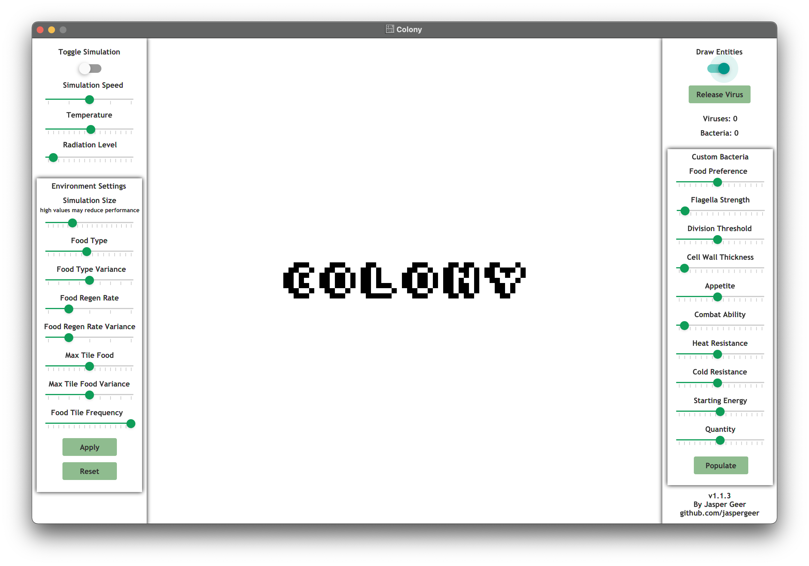
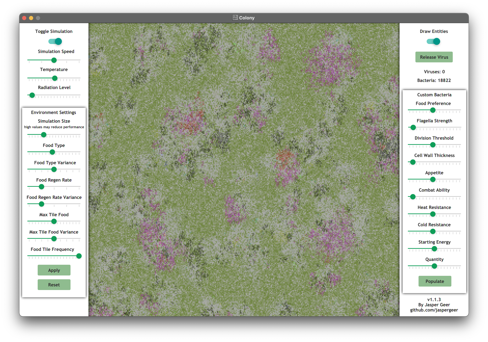
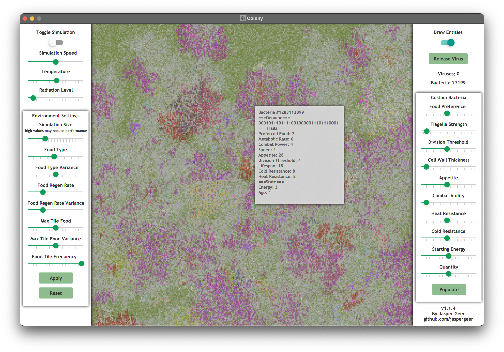
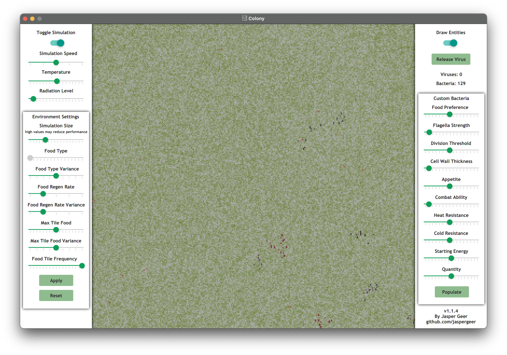

# Colony User Guide

Welcome to Colony! Let's get you started exploring the simulation!

## The Interface

This is the screen you will be greeted by when you first start the program. There are a few key elements here.

In the upper left corner is a switch labeled **Toggle Simulation**. Clicking this will start and stop the simulation.

Below is a pane labeled **Environment Settings**. The sliders in this pane control the type and availability of food, as
well as the size of the map. Settings can be applied to the current simulation by pressing **Apply** and the simulation
can be reset with a new size by pressing **Reset**. Leave these be for now.

In the upper right corner is a switch labeled **Draw Entities**. If you typically experience eye strain or other
discomfort when viewing flashing/rapidly changing imagery, switching this off is highly recommended.

Below is a pane labeled **Custom Bacteria**. The sliders in this pane allow you to customize the traits of a bacteria
and populate the map with copies of it. Leave these be for now.

Now its time to switch on the simulation. Click **Toggle Simulation** in the upper right and **Populate** in the
**Custom Bacteria** pane.

## The Simulation

Your screen should start looking something like this as your bacteria take hold and begin to reproduce and spread. After
a few seconds, stop the simulation and mouse over the bacteria.

You should be able to see genetic and phenotypic information! The original bacteria all started with the same genome, but
you may start seeing some mutations! These mutated strains will have slightly different traits and be shown with
different colors.

Resume the simulation and wait for the map to fill with bacteria. Once it has, we are ready for our first experiment!

Set the **Food Type** slider in **Environment Settings** to **0** and press **Apply**.

You should see most of the bacteria die out as the food tiles reset and regenerate. However, a few will survive and
begin repopulating the map. Pause the simulation and check the traits of these new bacteria. The bacteria we started
with all had food preference values of around 8 while these new bacteria have values of 0. We have just seen natural
selection in action!

Changing the type of available food has prevented most bacteria from surviving and multiplying, leaving only those with
the mutation allowing them to process food type 0. You can repeat this process with the other **Environment Settings**
sliders or the **Temperature** slider. If you make changes too drastically, you risk killing off your population, but
given enough headroom, your colony will adapt to the changes you make!

## What Next?
Colony includes more functionality than what is covered in this Guide, including Viruses which kill any bacteria lacking
certain mutations. However, you should now be able to navigate the user interface and understand what you see on the
screen. Thank you for reading and I hope you enjoy!
